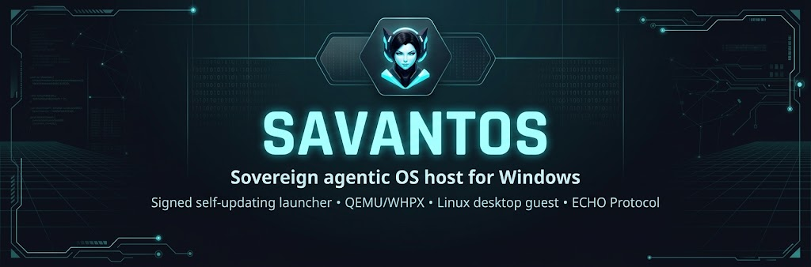

# SavantOS

<p align="center">
  
</p>

A sovereign agentic OS host for Windows: one signed, self-updating launcher
that runs a full Linux desktop guest in a window — QEMU on the Windows
Hypervisor Platform (WHPX), a prebuilt Arch image with the Omarchy desktop
baked in, rendered on your actual GPU (virgl + Venus Vulkan via
[WINQ-EMU](https://github.com/cmspam/winq-emu)) with CPU rendering as the
automatic fallback. No partitions, no bootloader, no dual boot: everything
lives in one folder chosen on first run, with `%LOCALAPPDATA%\SavantOS` as the
default.

Download, boot, Hyprland.

**Status: working end to end on real hardware.** The launcher pins its trust
anchors and release URLs to `savant0x/SavantOS`; the first SavantOS factory
image shipped as [v0.0.1](https://github.com/savant0x/SavantOS/releases/latest)
on 2026-09-11. This repository is a hard fork of
Try Omarchy for Windows — see [provenance](#provenance-and-credits).

## Install

**Requirements:** Windows 10 or 11 (Home or Pro), a 64-bit CPU with
virtualization enabled in your firmware, and space on a local NTFS or ReFS
drive for the guest image and virtual disk. If WSL2 runs on your machine, the
Hypervisor Platform is already there. No Hyper-V role, no partitions, no
reboot-into-Linux.

**1. Download the launcher** (~8 MB) from the latest release:

```text
https://github.com/savant0x/SavantOS/releases/latest/download/SavantOS.exe
```

**2. Verify the checksum.** The launcher digest-verifies everything else it
downloads, so the exe is the only file you check yourself. In the download
folder:

```powershell
$expected = (Get-Content SavantOS.exe.sha256).Trim() -split '\s+' | Select-Object -First 1
if ((Get-FileHash SavantOS.exe -Algorithm SHA256).Hash -ieq $expected) { 'checksum OK' } else { 'MISMATCH - do not run' }
```

or, in Git Bash: `sha256sum -c SavantOS.exe.sha256`.

**3. Double-click `SavantOS.exe`.** Windows may show a one-time
"Windows protected your PC" prompt while the launcher is unsigned — choose
**More info → Run anyway**.

### First run

- **Pick a data location.** The default is `%LOCALAPPDATA%\SavantOS`; another
  local drive works too and a small pointer stays behind so later launches
  find it. Everything lives in this one folder — delete it and SavantOS is
  gone.
- **One permission prompt, one restart** if the Windows Hypervisor Platform
  is not enabled yet; the launcher enables it for you.
- **The launcher downloads and verifies the payload** — the GPU runtime
  (~84 MB) and the guest image (~1.7 GB) — against a SHA256 digest pinned in
  its own source, then boots straight to the Omarchy desktop (a few seconds
  on mid-range hardware).
- **Pick an account:** the instant trial (`savant` / `savant`, disposable,
  passwordless sudo) or the normal personalized setup. SDDM autologins
  either way.
- **Shortcuts are optional.** After setup the launcher keeps a stable copy in
  the data folder and can add Start-menu and Desktop shortcuts; later
  launches skip every step above and go straight to the desktop.

Updates are self-served: the launcher checks GitHub, verifies every download
against its pinned digests and Ed25519-signed manifests, and stages updates
atomically with rollback. To check the wiring without updating anything, run
`SavantOS.exe -diagnostics` for a redacted support zip.

## What works today

- **The full Omarchy 4.0.2 desktop on new or reset guests**: Hyprland, the
  bar, notifications, all 22 themes, the screensavers. On a mid-range Ryzen 5
  test laptop the desktop is up about 6 seconds after launch, and every launch
  after setup goes straight there. No Linux login screens, no console text.
- **GPU acceleration**: Hyprland renders on the host GPU via virgl,
  `vulkaninfo` shows Venus, smooth video and audio; `-cpu host` (AVX2 and all)
  via WINQ-EMU's patched WHPX.
- **One app, zero prerequisites**: `SavantOS.exe` (~8 MB, no console window).
  First run lets you keep the default Local AppData location or choose another
  local drive or folder, switches on Windows' Hypervisor Platform (one
  permission prompt, one restart), then downloads the SHA256-verified GPU
  runtime and image and boots into the desktop. Once setup is complete it
  keeps a stable launcher in the chosen data folder and can add optional
  Start-menu and Desktop shortcuts. After that it supervises everything:
  GPU/CPU auto-detect, the known WHPX launch wedge, in-guest reboot relaunch,
  poweroff cleanup.
- **Feels like an app, not a VM**: the window is branded "SavantOS", the
  Windows key acts as Super only while the window is focused (Start menu and
  Win+Shift+S keep working everywhere else), Ctrl+Alt+F goes fullscreen.
- **Two-way text and image clipboard sharing** between Windows and the guest
  (a compositor-native bridge over wl-clipboard, no SPICE) and **folder
  sharing** over virtio-9p: standard installs offer to create a shared folder
  in your Windows home, then pin it in the guest's Files sidebar and link it
  into the Linux home. The tray can open the Windows folder at any time. File
  clipboard and drag-and-drop are not supported yet; use the shared folder to
  move files.
- First boot offers an instant trial account or the normal personalized
  account setup, with SDDM autologin after either path. Instant mode keeps
  `savant` as both the local username and lock-screen password, shows that on
  the setup splash, and repeats it once on the first desktop. Sudo remains
  passwordless in this disposable local trial.
- Reproducible x86_64 guest image build (containerized, package-locked, pinned
  upstream revision) and a headless QMP control plane for automated testing.

See [app compatibility](docs/COMPATIBILITY.md) for package support and current
VM limitations.

## Essential keys

- **Windows key** acts as Super, but only while the SavantOS window is
  focused. Everywhere else it stays your normal Windows key, so the Start menu
  and Win+Shift+S keep working.
- **Ctrl+Alt+F** fullscreens the VM window itself on your Windows desktop
  (SUPER+F, below, is the in-guest one).
- **Ctrl+Alt+G** grabs or releases raw keyboard input. If the host steals a
  shortcut you meant for the guest, grab first. Same trick if you're driving
  the VM over VNC or RDP and focus gets weird.
- Hyprland is keyboard-first by design and the first hour is the adjustment
  period. Learn two keys and the rest follows: **SUPER+SPACE** opens the
  menu, **SUPER+K** opens the keybinding viewer with every binding and its
  description. The everyday starters: SUPER+RETURN opens a terminal, SUPER+W
  closes the focused window, SUPER+F fullscreens it.

## Architecture

Same recipe as the excellent macOS
[try-omarchy](https://github.com/themartiano/try-omarchy) (QEMU + Apple
Hypervisor Framework + VirGL), translated to Windows:

| Piece | macOS (try-omarchy) | SavantOS |
|---|---|---|
| Hypervisor | Hypervisor.framework | Windows Hypervisor Platform (WHPX) |
| Guest image | ARM64 Arch + Omarchy | x86_64 Arch + Omarchy |
| Graphics | VirGL | virtio-gpu virgl + Venus Vulkan (WINQ-EMU); llvmpipe fallback |
| App shell | Swift/AppKit | Go: one console-less `SavantOS.exe` |

WHPX works on Windows Home and Pro (it's the same platform WSL2 rides on), so
no Hyper-V role is required. If WSL2 runs on your machine, you're set.

Proven boot recipe: `-accel whpx -machine q35 -cpu qemu64`, direct kernel boot
(vmlinuz + initramfs + raw ext4 rootfs on virtio-blk), all-virtio devices.
See [docs/FINDINGS.md](docs/FINDINGS.md) for the details and the traps.

## Build from source

Any machine with Go builds the launcher; the exe runs on Windows:

```bash
git clone https://github.com/savant0x/SavantOS
cd SavantOS/app
GOOS=windows GOARCH=amd64 go build -trimpath -ldflags "-H windowsgui -s -w" -o SavantOS.exe .
```

The launcher embeds and pins the SHA256 digest of the default release's
`SHA256SUMS` file. It verifies an existing cache before trusting it, records a
manifest-bound install receipt for fast offline launches, and only promotes
fully written staging files into place. When publishing a new image release,
update `defaultReleaseURL`, `defaultSumsSHA256`, and the matching fixture in
`app/testdata`, plus `currentVersion` in `app/update.go`. Custom release URLs
must be paired with the trusted manifest digest via `-sums-sha256`.

Updates are atomic: new files are fully downloaded and verified before they
replace anything, and the previous launcher, bundled runtime, and factory
image remain available until the updated VM reaches a healthy boot. Release
metadata is signed with a separate Ed25519 update key whose public half is
pinned in `app/update.go`.

## Reporting a problem

Run `SavantOS.exe -diagnostics`. It writes one zip under the chosen data
folder's `diagnostics` directory with the launcher and QEMU logs, the guest's
console output, redacted settings, install and update state, the guest
manifest, and machine facts (Windows build, CPU, memory). It includes no disk
images or home-folder files and redacts known account paths and SSH key data.
Logs can still contain local details, so review the zip before attaching it.

## Install location

New standard installs ask for a data location before downloading anything.
The default is `%LOCALAPPDATA%\SavantOS`. Choosing another local drive or
folder creates a `SavantOS` folder there and keeps a small
`%LOCALAPPDATA%\SavantOS\data-location.json` pointer so direct launches can
find it. Standard installs require an NTFS or ReFS local drive because the
virtual disk uses sparse files. Network locations are not supported. An
explicit `-dir PATH` still wins for that launch. Portable mode continues to
support exFAT through the `data` and `payload` folders beside the executable.

## Settings

`settings.json` in the chosen data folder keeps the choices that survive a
relaunch. Every row has a matching flag, and a flag given on the command line
wins for that launch:

```json
{
  "schemaVersion": 1,
  "fullscreen": false,
  "memoryMiB": 0,
  "cpus": 0,
  "share": "",
  "shareDisabled": false,
  "sharedFolderPrompted": true,
  "forwards": ["tcp:2222:22"],
  "sshKey": "",
  "render": "auto"
}
```

`fullscreen` is the Immersive mode (`-fullscreen`), `memoryMiB` overrides the
automatic guest RAM sizing (`-memory`, 0 keeps it automatic), `cpus` overrides
the automatic vCPU count (`-cpus`, 0 keeps it automatic), `share` remembers
the Windows folder shared into the guest (`-share`), `shareDisabled` turns
that folder off without forgetting it, `forwards` are loopback port forwards
(`-forward`), `sshKey` is the public key file to authorize when a forward
targets sshd (`-ssh-key`), and `render` picks the rendering path (`-render`).
Open Settings from the tray, the Start menu, or `SavantOS.exe -settings`.

`render` is `auto` by default: the launcher tries GPU rendering and, when this
PC cannot run it, remembers that in `render-probe.json` so later launches go
straight to CPU rendering instead of repeating the failed attempts. It retries
the GPU path when the runtime or the display drivers change, and once a day.
`gpu` retries every launch; `cpu` never tries it (`-nogpu` means the same).

Automatic sizing gives the guest all logical processors but two, between two
and eight, and a third of the machine's RAM between 4 and 8 GiB (6 GiB with
GPU rendering, the same as before), reduced to what Windows can spare at
launch.

The guest follows the Windows time zone, default keyboard layout, and display
language. Each is applied inside the guest when it changes on the Windows
side, so a layout, zone, or language chosen inside the guest stays until
Windows changes. `-timezone`, `-keyboard`, and `-locale` override this for a
launch: `keep` leaves the guest alone, or give an IANA zone such as
`Europe/Berlin`, an XKB layout such as `de` or `us:intl`, or a locale such as
`de_DE`. The language takes effect at the next login inside the guest.

## Disk capacity

Open Settings and set **Disk capacity (GiB)**, or launch with `-disk-size 64`.
Standard installs accept 24 to 1024 GiB; 0 keeps the release default. The next
launch grows an existing disk in place and preserves its files. Lowering the
setting never shrinks the disk. A fresh guest uses at least the factory
image's required capacity.

Capacity is a limit, not space reserved on Windows. The sparse disk uses host
storage as you add files. Settings shows the current capacity and free space
on the Windows drive. Keep important files backed up outside the guest.

Deleting files inside the guest does not shrink the disk file by itself.
While the guest is running, `SavantOS.exe -reclaim` asks it to write zeros
over its free space, up to what the Windows drive can spare beyond a 4 GiB
reserve and at most 8 GiB per pass, and the disk file shrinks the next time
the guest shuts down. Run it again for another pass if a lot was deleted.

This preference is saved separately in `storage.json` so older launchers can
still read their settings after rollback. An explicit `-disk-size` applies
only to that launch. Portable QCOW2 disks keep their existing capacity.

## SSH and port forwarding

Nothing listens by default. To reach the guest from Windows tools, forward a
loopback port:

```bash
SavantOS.exe -ssh 2222
```

That forwards `127.0.0.1:2222` to the guest's sshd for this session only and
asks the guest to start sshd for that boot. Nothing on your network can reach
it. Your `~/.ssh/id_ed25519.pub` (or `id_ecdsa.pub`, `id_rsa.pub`) is
authorized for the trial account automatically; pass `-ssh-key PATH` to pick
another public key. Then:

```bash
ssh -p 2222 savant@127.0.0.1
```

The same alias works for `scp`, Git, and VS Code Remote SSH. Other services
use `-forward tcp:8080:80` or `-forward udp:5000:5000` (repeatable); the guest
service must listen on its network interface, not only on its own localhost.
From the guest, `windows.host:<port>` (10.0.2.2) reaches a service on Windows
without any mapping. A fresh disk (`-fresh`) gets a new host key, so remove
the old `[127.0.0.1]:2222` entry from `known_hosts` if ssh complains.

## Taking your setup to a real Omarchy install

Inside the guest, run `savantos-export`. It writes one archive with your
desktop configuration, theme, and the packages you added, to the shared
Windows folder when one is mounted (`-share`) or to your home folder
otherwise. On the real install, extract it and run the `restore.sh` inside.
Keys, password stores, browser profiles, and unlisted application configs are
deliberately left out. Review the archive before sharing it with anyone. See
[`docs/MIGRATION.md`](docs/MIGRATION.md).

## Offline portable mode

The launcher also accepts `-portable` for an experimental, persistent USB
layout. In this mode it reads an authenticated release payload beside the
executable, makes no setup-time network requests, stores all guest state on
the removable drive, and uses a compact QCOW2 overlay that survives Windows
drive letter changes and works on exFAT. The independently pinned
`SHA256SUMS` digest, install receipts, cancellation handling, and atomic file
publication apply to the portable path too.

See [`docs/PORTABLE_USB.md`](docs/PORTABLE_USB.md) for the expected layout and
host requirements.

## VM backups

Backup, restore, and reset controls are available in Settings for stopped
standard installs. Restore creates a separate copy. Command-line options are
also available. See the [backup guide](docs/BACKUP.md) for usage, storage
requirements, and current limitations.

## FAQ

### Isn't this just QEMU in disguise?

Yes, and that's the point. QEMU on WHPX is the best virtualization stack
Windows has, but wiring it up yourself (machine type, virtio devices, GPU
forwarding, input handling, the known launch wedges) is a weekend project on
its own. The app does that wiring for you, supervises the VM, and keeps
everything in one folder you can delete.

### Why is the download only ~8 MB?

`SavantOS.exe` is just the launcher. On first run it fetches the GPU runtime
(~84 MB) and the guest image (~1.7 GB), SHA256-verifies both, and caches them
in the data folder you chose. After that, launches work offline.

### Why not just use a live USB?

A live USB means rebooting away from your machine and forgetting everything
on shutdown. This runs in a window next to your actual work, keeps your state
between sessions, and renders on your real GPU.

### What are the instant trial credentials?

The local trial account is named `savant` and its lock-screen password is
`savant`. Sudo does not ask for a password in instant trial mode. SavantOS
does not enable SSH or expose inbound network ports unless you ask for a
forward with `-ssh` or `-forward`, and those bind to `127.0.0.1` only.

### How do I remove SavantOS?

Close the guest, then use **Remove SavantOS** in Settings, the SavantOS entry
in Windows Apps & features, or `SavantOS.exe -uninstall`. It offers a full
backup first, then removes the shortcuts, the Apps & features entry, the
saved data location, and the data folder with the launcher, runtime, image,
and writable virtual disk. Windows shared folders and the original downloaded
`SavantOS.exe` are kept; delete those by hand if you no longer want them.

### I have the full Hyper-V feature set installed. Will it conflict?

WHPX and Hyper-V share the same Windows hypervisor and are designed to
coexist. We have not yet validated every SavantOS feature on a machine with
the full Hyper-V feature set enabled, so please open an issue if you hit
anything odd.

## Repository layout

- `app/` — the app itself: one Go exe covering the launcher, supervisor,
  first-run download, focus-scoped Win-key forwarding, and the host side of
  the clipboard bridge
- `runtime-build/` — the source-locked Windows QEMU runtime build,
  verification, licenses, and provenance tooling
- `scripts/` — PowerShell path plus QMP tooling (screendump, send-key, WHPX
  smoke test)
- `guest-build/` — patches on the upstream guest builder that produce our
  image, plus build instructions
- `docs/` — operator documentation and technical findings

The guest image (Omarchy 4.0.2, all upstream themes, screensavers, autologin,
clipboard bridge) is built from
[jorge-huxley/try-omarchy-win](https://github.com/jorge-huxley/try-omarchy-win)'s
`win` branch guest builder — an x86_64 retarget of the upstream try-omarchy
build system — with the patches in `guest-build/` applied. Images are not
committed; setup downloads the latest release artifact, or build your own.

## Provenance and credits

SavantOS is a hard fork of
[Try Omarchy for Windows](https://github.com/omacom/try-omarchy-windows)
(v0.0.14-preview, itself by tsouth89/omacom), relicensed under Apache-2.0; the
inherited release history is preserved in [`CHANGELOG.md`](CHANGELOG.md) and
[`NOTICE.md`](NOTICE.md). The project stands on a lot of shoulders:

- [Omarchy](https://github.com/basecamp/omarchy) by DHH / Basecamp — the
  desktop this is all about; its mark and product name are theirs
- [try-omarchy](https://github.com/themartiano/try-omarchy) by Eduardo
  (themartiano) — the original macOS app and the architecture this follows
- [try-omarchy-win](https://github.com/jorge-huxley/try-omarchy-win) by Jorge
  Silva — the x86_64 guest builder retarget and the proven WHPX boot recipe
- [WINQ-EMU](https://github.com/cmspam/winq-emu) by cmspam — Venus Vulkan GPU
  forwarding for QEMU on Windows, the graphics path
- [omarchy-windows-hyperv-gpu](https://github.com/Chainfire/omarchy-windows-hyperv-gpu)
  by Chainfire — prior art proving GPU-accelerated Omarchy on Windows, plus
  the QEMU 11 WHPX interrupt findings
- [dockur/windows](https://github.com/dockur/windows) — the Windows-in-Docker
  environment this is developed and tested in

## License

This repository is licensed under [Apache-2.0](LICENSE). Omarchy and the
guest image contents carry their own licenses.
